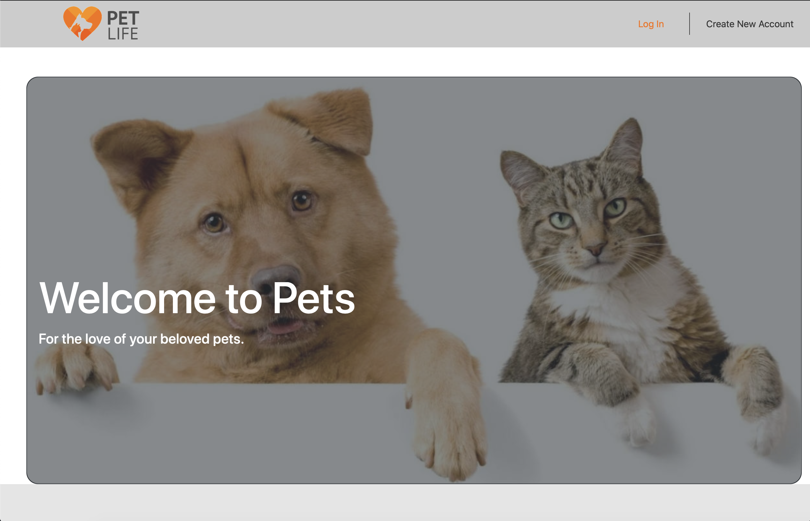

# Pet Life
## Overview
Pet Life is a MERN stack web application designed to be a one stop website for keeping track of all your pets, pet information, doctors visits, prescriptions and sitters information. https://pet-life-2019.herokuapp.com

## Built With
- MongoDB - NoSQL Database
- Express.js - Node.js framework
- React.js - MVC front-end framework
- Node.js - JavaScript runtime
- npm - Node package manager
- Sass (or scss) - CSS framework

## Walkthrough
- Deployment link: https://pet-life-2019.herokuapp.com

