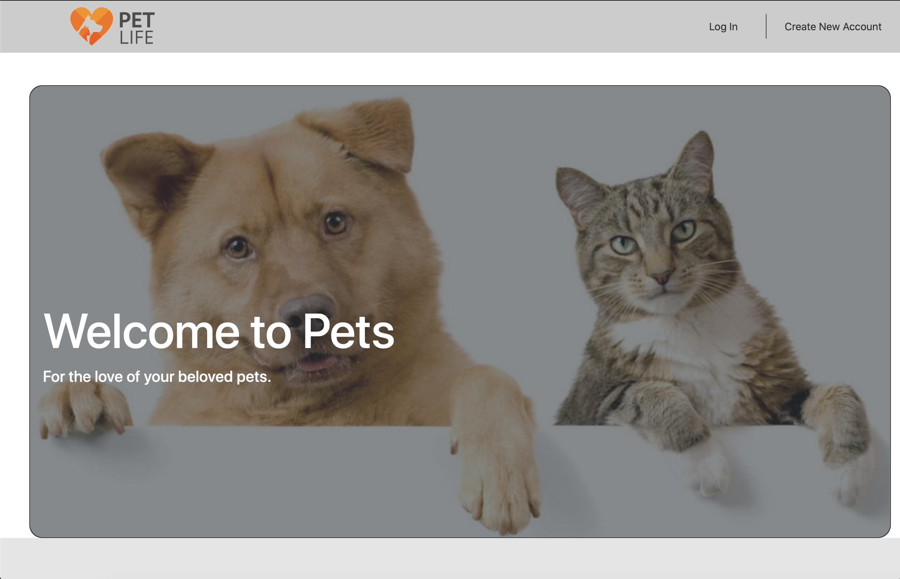
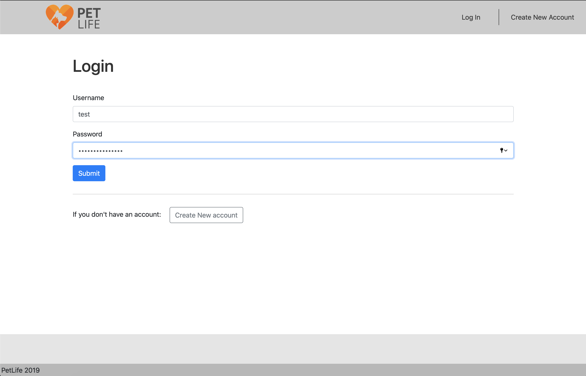
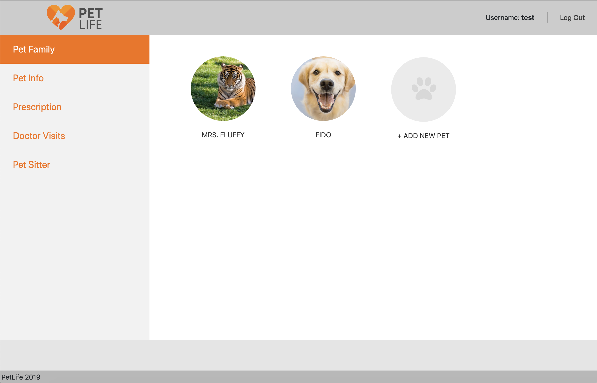
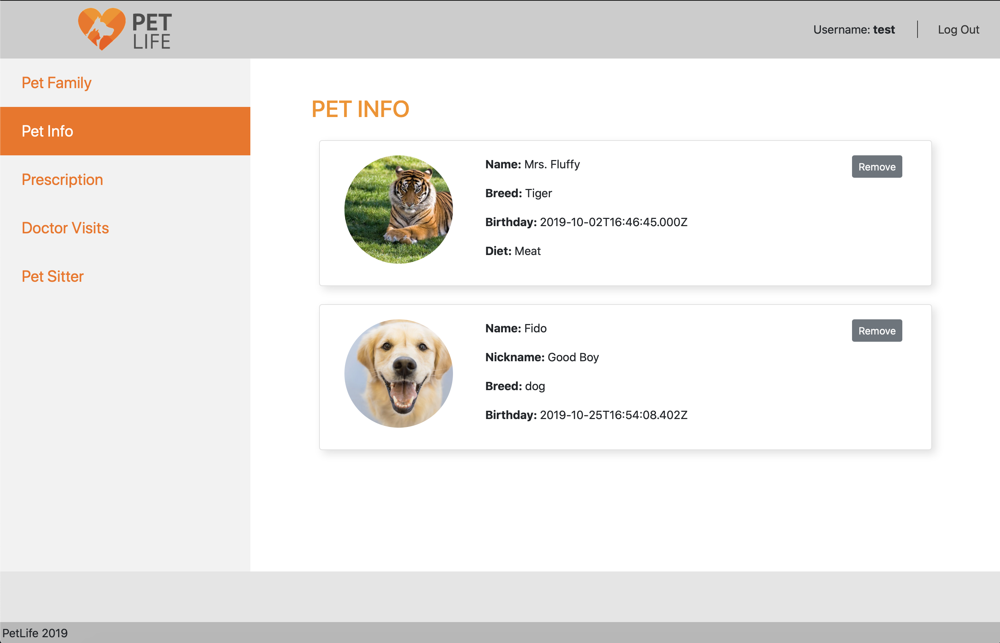
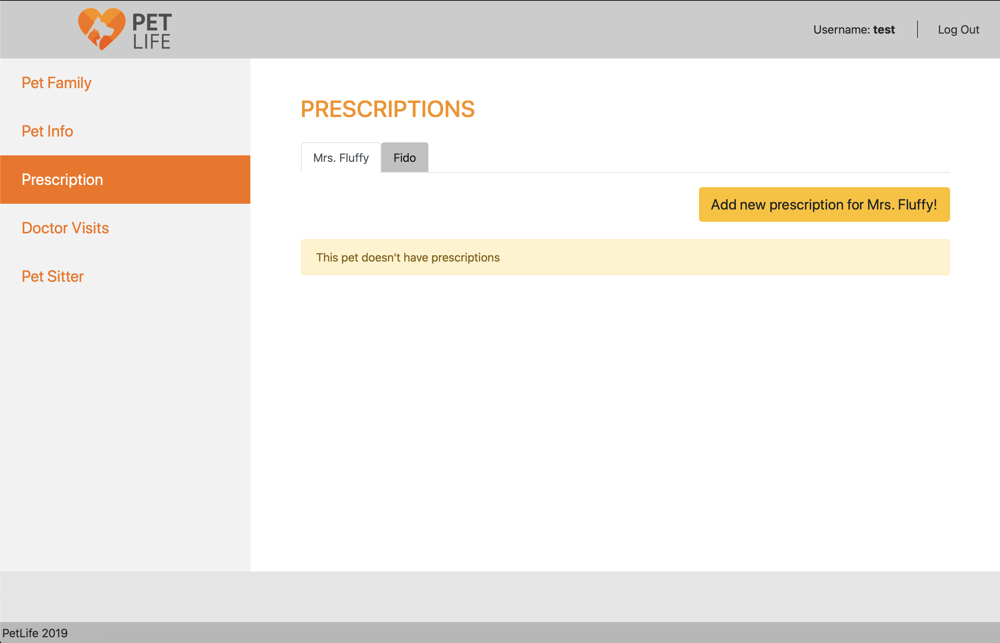
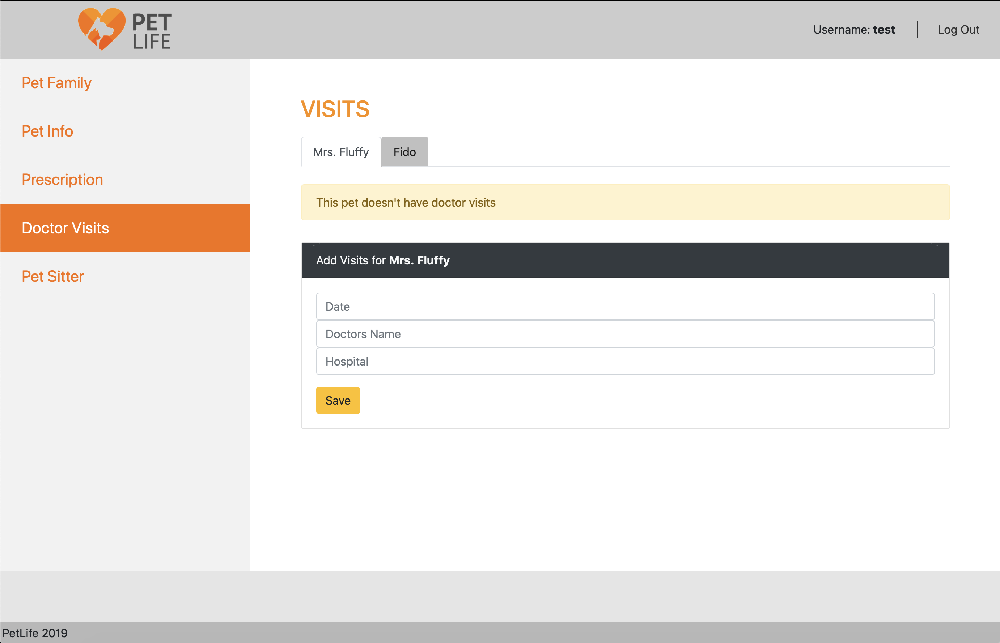
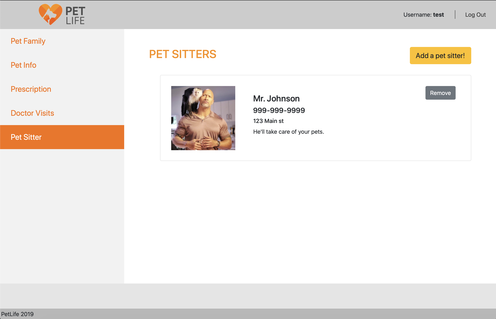

# Pet Life
## Overview
Pet Life is a MERN stack web application designed to be a one stop website for keeping track of all your pets, pet information, doctors visits, prescriptions and sitters information. 

## Built With

- [Mongo DB](https://www.mongodb.com/) - NoSQL Database
- [Express.js](https://expressjs.com/) - Node.js framework
- [React.js](https://reactjs.org/) - MVC front-end framework
- [Node.js](https://nodejs.org/en/) - JavaScript runtime
- [npm](https://www.npmjs.com) - Node package manager
- [Sass](https://sass-lang.com) (or scss) - CSS framework

## Views

### Landing page
PetLife is a simple application for storing pet information. On the landing page we have two options:
- Login: Redirects the user to the login page
- Create Account: Redirects users to a create account page

> Note: We use protected routes to protect the application and the users personal information. For example if you were to attempt to bypass the login process and enter the hashed ID such as https://pet-life-2019.herokuapp.com/user/5db3258a376a8f002a6be58d/petfamily (the hashed id for the test account provided below) in the url bar, you will be redirected back to the login page.

### Login Page

### Pet Family Page
This is the main pet family page. The user is allowed to add pets to their family and logout in the top right of the screen.

### Pet Info Page
The Pet Info tab gives the user a very quick overview of their pets and has the ability to remove pets from their family.

### Pet Prescriptions Page
The prescription page allows users to add prescriptions for their pets based on the tabbed pet selected.

### Pet Doctors Visits Page
The doctor visits page allows users to add doctors visits for their pets based on the tabbed pet selected.

### Pet Sitters Page
The pet sitter page displays some basic information about their pet sitters as well as allows the user to manage pet sitters by adding and removing them.

## Authors
See the list of [contributors](https://github.com/Mezran/Pet-Life/graphs/contributors) who participated in this project along with individual commit history.

copyright 2019 &copy; Stephen Allen
